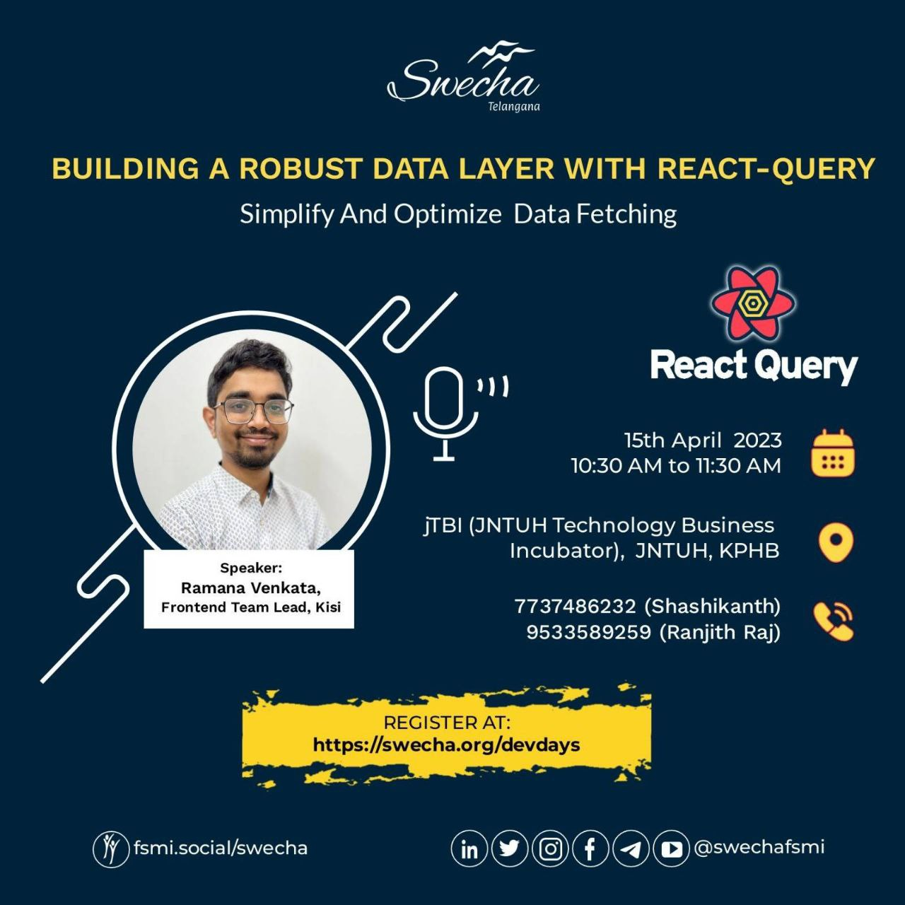

# Building a robust data-layer with react-query

*Website*: https://react-query-talk.vramana.com
*Playground*: https://react-query-2023.netlify.app

This is a talk I gave at Swecha DevDays meetup on April 14th 2023.

*Remarks*: The talk is not super polished but it covers enough details.

Here is the talk poster:

